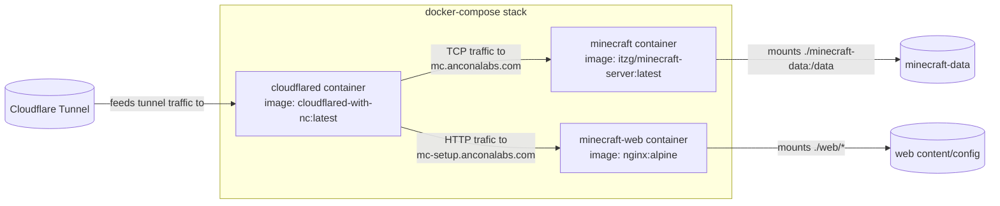

# minecraftExternalServerSetup

A repo for depoly an MC setup on my local hypervisor.



## Useful MC commands
```bash

docker exec -it minecraft ...
	whitelist on
	add <user>
	gamemode creative <user>
	gamemode survival <user>
	spawnpoint <user>
	tp <MeToUser> 
	tp <user> <toMe>